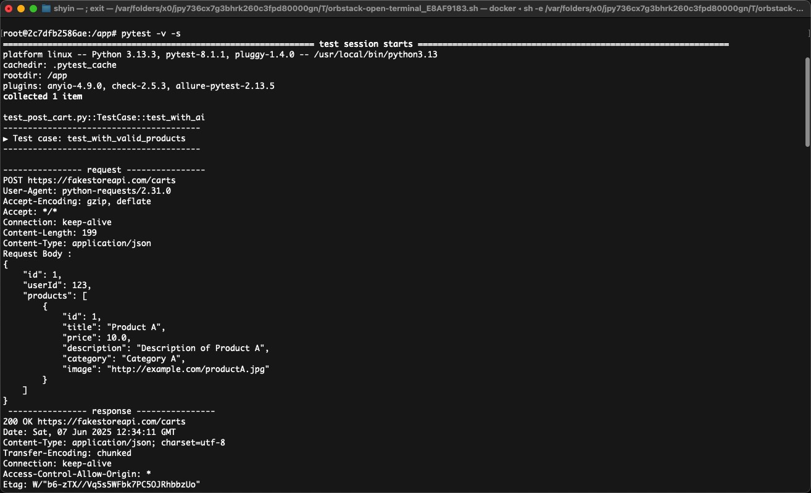

# Software testing in OpenAI & Pytest

## Article
- English Version: https://medium.com/@shyinlim/boost-api-testing-efficiency-with-openai-and-pytest-d7ca2b4f574a
- 中文版本: https://jkopay-sdet.medium.com/透過-openai-與-pytest-提升-api-測試效率-6c8dc92d5495

## Intro
Integration of OpenAI with Pytest to automate API test generation.

## What You Need to Know and Prepare
- OpenAI Python Library <br>
https://github.com/openai/openai-python
- Pytest (Python testing framework) <br>
https://github.com/pytest-dev/pytest
- API Under Test FakeStoreAPI (Cart endpoint) <br> 
https://fakestoreapi.com/docs#tag/Carts/operation/addCart

# Dev Mode, Deployment, Debug
1. Setup the `OPENAI_API_KEY` at `/deployment/.env`
```commandline
OPENAI_API_KEY=sk-xxxxxxx
```


2. Run the command line on terminal.
```commandline
$ make run-docker
```


3. Run the command line on Docker's terminal.
```commandline
$ pytest -v -s
```


## Result


